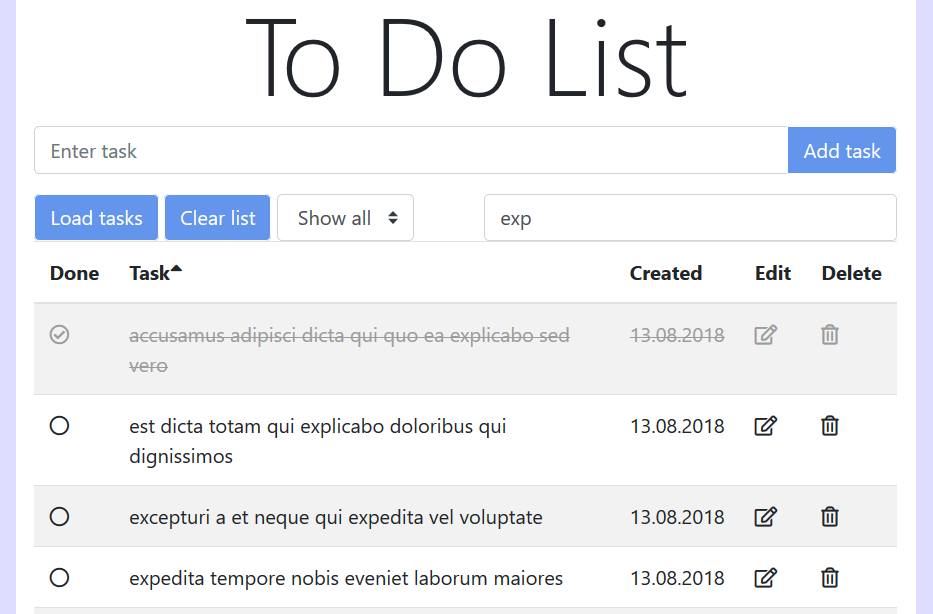

# ToDo List
ToDo List is a web application for managing personal tasks.

# Implemented Features
* Add task
* Mark task done or undone
* Edit task (by using modal window)
* Delete task
* Display all, only done or only undone tasks
* Store list of tasks in browser local storage

# Screenshots
Overview

Task edit mode

# Built With
Vanilla JS ES2018